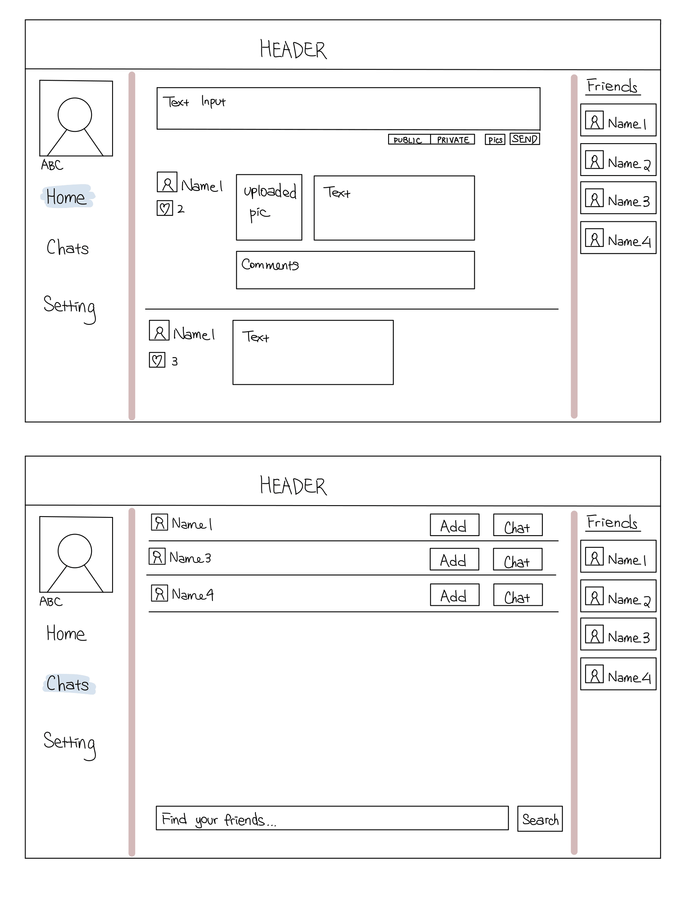
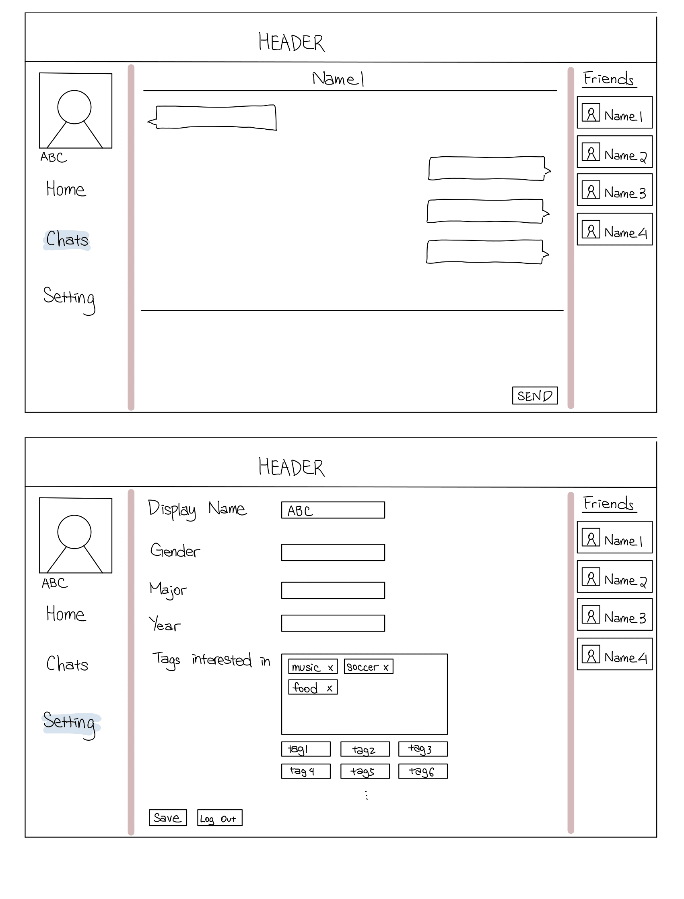

# CPSC436 Group Project

[](https://travis-ci.com/ZijiaZhang/CPSC436_Project)
[](https://codecov.io/gh/ZijiaZhang/CPSC436_Project)

# Script Usage

## Preview Frontend React
```shell script 
npm run dev
```

## Preview Frontend React
```shell script 
npx webpack
```


## Project Description: 
Our project aims to provide a friendly and focused environment for UBC students who are looking for friends, activities, or simply want to stay updated with what’s going on. Users can do things such as finding people who are in the same lecture or lab section as them, forming a study group for midterms or finals, looking for carpooling, etc.

## Who is it for?
UBC students who want to find friends with same classes, hobbies, and etc

## What will it do? 
- News feed page to share texts and pictures, like Twitter
- Chat room
- Add friends

## What type of data will it store?
- Username/ Password
- Basic User information
- Chat history
- Activity history (number of likes or comments) of posts in the news feed page

## What will users be able to do with this data?
- Log in/off and sign up
- Search for, query by hobbies, gender, classes etc (search option)
- Find/Add friends with similar hobby tags
- Interact on posts, such as comment or like

## What is some additional functionality you can add/remove based on time constraints?
- Apps to help users get to know each other   
- Better Recommendation on news feeds
 
# Project task requirements:
## 3-5 minimal requirements (will definitely complete)
- User Logon/Sign up
    - Frontend Designs for both Logon and Signup
    - Database Design for User Information and node server

- News feed page to post, share thought in text, picture
   - Design of input editor (picture, text messages)
   - Comment/follow up functionality (reply to message)
   - Design of layer of posts and comments (arrangement of messages, picture, comment)
   - Action bar to post (like, dislike, emoji)
   - Database desgin for comment history and like numbers
- Add friends
   - Implementation of friend-related menu (in right panel), and arrange its position
   - Find friends by id
   - Arrange the searched results (how resultant users are displayed and what personal information can shown)
- Two people chat in the private chat room
   - Design of displayed message
   - Text input editor
   - General chatting room layout
   - Backend (network connection and online message transmission between users)
- Find, search people by name, gender, tag
  - Algorithn to search for and (by name or hobby tag)

## 3-7 "standard" requirements (will most likely complete)
- Recommend by tags (people you may be interested in)
- Backend management system (Administrator)
- Able to set blog post to public/private/to friends
- Announcement system (public posts)
- Comment, Like to a post
- Hide Post, and Avoid Similar Posts
- BlackList

## 2-3 stretch requirements (plan to complete 1!)
- Group chat
- Apps and games to help users interact
- Smart Algorithm for recommended posts and friends as well as avoided posts and users

# Designs


